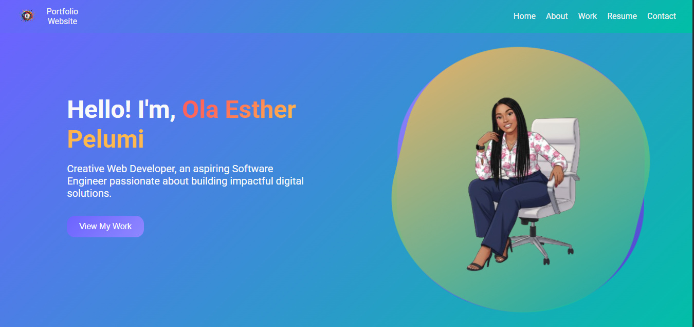
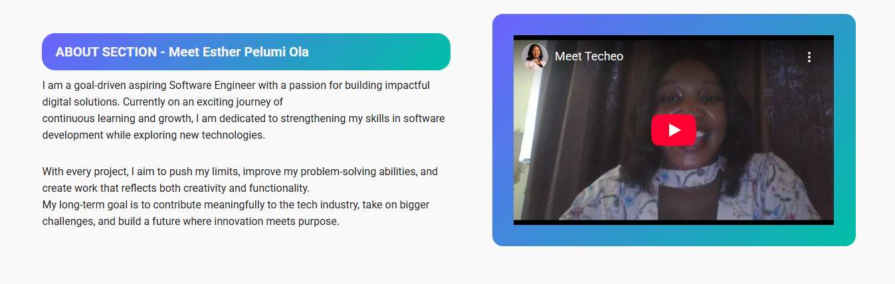
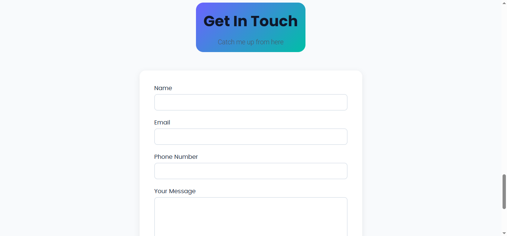

# HTML Portfolio Website

A simple yet **stylish personal portfolio website** built with **pure HTML and CSS**.
This project showcases my profile, hero section, about section, projects, resume, and contact form in a clean, responsive, and modern layout **without any external frameworks**.

## Features

- **Styled Navigation Bar** – A clean and responsive header with a gradient background for easy access to different sections.
- **Hero Section** – Beautiful gradient background with highlighted text and animated shapes behind the hero image for a professional look.
- **About Section** – Well-structured content with improved typography and layout for better readability.
- **Work Section** – Showcases personal projects with demo and repo links.
- **Resume Section** – Displays education, skills, and project history in a structured way.
- **Contact Section** – Simple contact form to collect user details and messages.
- **Footer** – Contains quick navigation links and contact information.

## Project Structure

```bash
.
├── index.html
├── style.css
├── assets/
│   ├── images/
│   └── icons/
└── README.md
```

## How to Use

1. **Clone the repository**:

   ```bash
   git clone https://github.com/your-username/html-portfolio.git
   ```

2. **Open the project** in your browser:

   ```bash
   open index.html
   ```

   or simply double-click the `index.html` file.

## Screenshots

1. **Navbar & Hero Section**
   

2. **About Section**
   

3. **Work Section**
   

4. **Resume Section**
   

5. **Contact Section**
   

6. **Contact Section & Footer**
   

## Technologies Used

- **HTML5** – Semantic structure for accessibility and SEO
- **CSS3** – Custom gradients, layout styling, animations (no frameworks)
- **Responsive Design** – Adjusts layout for different screen sizes

© 2025 Ola Esther Pelumi. All rights reserved.
